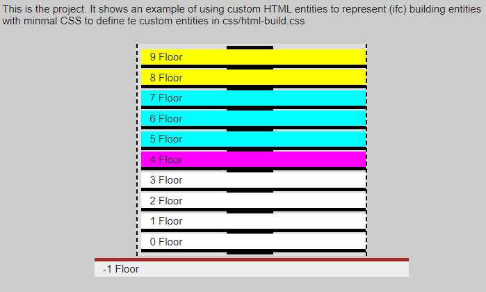

# Building description using custom HTML entities
Developed based on conversations with [JosepMariaPujol](https://github.com/JosepMariaPujol/HTML-Build) for his super awesome thesis project. Now expanded to include conversations with [aothms](https://github.com/aothms). In this repo they are focused this is focused on defining custom HTML entities that represent (IFC) building entities with minimal [CSS](https://www.w3schools.com/css/default.asp) to define layers of attributes and properties.

## Aim 
Define a set of custom entities for building elements within an index.html file using HTML5 principles

## Objectives:

### 1) Provide useful information
* Provide a useful description of the building wihtout having to open the full 3d model.
* Be possible to adapt this view to use cases.


<p align = "center">
Basic building description result in HTML with some CSS
</p>

### 2) Standardised
* Provide a common file format across softwares / systems following IFC / ISO / National standards as much as possible.
* Use [HTML5](https://en.wikipedia.org/wiki/HTML5) principles to solve building modelling challenges, for instance IfcPropertySets would be defined in Cascading Style Sheets [(CSS)](https://www.w3schools.com/css/default.asp).

```CSS
project- {
	display:block;
	padding:5px;
	font-family: Arial, Helvetica, sans-serif;
	font-size:12px;
	background-color:#ccc;
	width:100%;
	border:none;
	color:#1b1b1b;
	margin:auto;
	padding-bottom:50px;
}
```
<p align = "center">
CSS example for project- custom entity (just display) instance attributes and properties would be contained in further CSS files declared in the document head.
</p>

### 3) Human editable
* Be super easy to learn [(from)](https://itc.scix.net/paper/w78-2021-paper-070)
* **fun for humans** to hack.

```HTML
<html>
	<head> <!--- this contains property links and entity attributes in css ---> </head>
	<body>
		<project->
			<site->
				<building->
					<core->
						<floor-></floor->
					</core->
				</building->
			</site->
		</project->
	</body>
<html>
```
<p align = "center">
Basic building description example in HTML
</p>

### 4) Extendable
* Possible to add new entities?
* Custom entities should support links to Linked data, Speckle streams, IFC.js and other emerging AEC web technologies.

```HTML
<!--- possible example of extension --->
		<project- src="[(url) link to IFC.js / speckle stream etc.]">
			<site->
				<building->
					<core->
						<!--- alternatively an entity could have link(s) --->
						<floor-></floor->
					</core->
				</building->
			</site->
		</project->
	</body>
<html>
```

This repo contains a minimal example with the basic CSS file. Other examples will be added soon.

