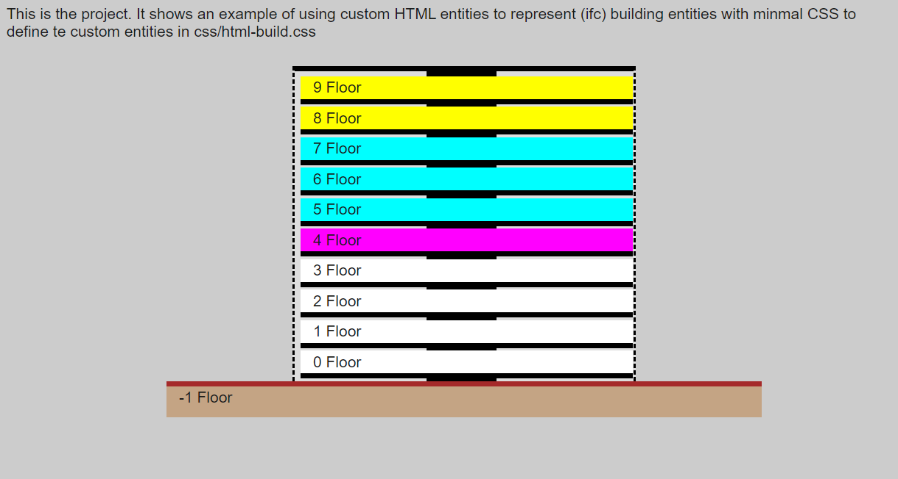

# Building description using custom HTML entities
Developed based on conversations with [JosepMariaPujol](https://github.com/JosepMariaPujol/HTML-Build)
for his super awesome thesis project.

The idea is to define custom HTML entities that represent (ifc) building entities. with minimal [CSS](https://www.w3schools.com/css/default.asp) to define layers of attributes and properties.

```HTML
<html>
	<head> <!--- this contains property links and entity attributes in css ---> </head>
	<body>
		<project->
			<site->
				<building->
					<core->
						<floor-></floor->
					</core->
				</building->
			</site->
		</project->
	</body>
<html>
```



## Aim 
Define a set of custom entities for building elements within an index.html file using HTML5 principles

## Objectives:

### 1) Provide useful information
* Provide a useful description of the building wihtout having to open the full 3d model.
* Be possible to adapt this view to use cases.

### 2) editable common and light format
* Provide a common **human editable** file format across softwares / systems following IFC / ISO / National standards as much as possible.
* Use [HTML5](https://en.wikipedia.org/wiki/HTML5) principles to solve building modelling challenges, for instance IfcPropertySets would be defined in Cascading Style Sheets [(CSS)](https://www.w3schools.com/css/default.asp).

### 3) based on extendable custom HTML entities
* be extendable (the custom et to include links (src) to Linked data, Speckle streams, IFC.js and other emerging AEC web technologies.

### 4) Easy for humans to hack
* Be super easy to learn [(from)](https://itc.scix.net/paper/w78-2021-paper-070) and **fun for humans** to hack.

This repo contains a minimal example with the basic CSS file. Other examples will be added soon.

